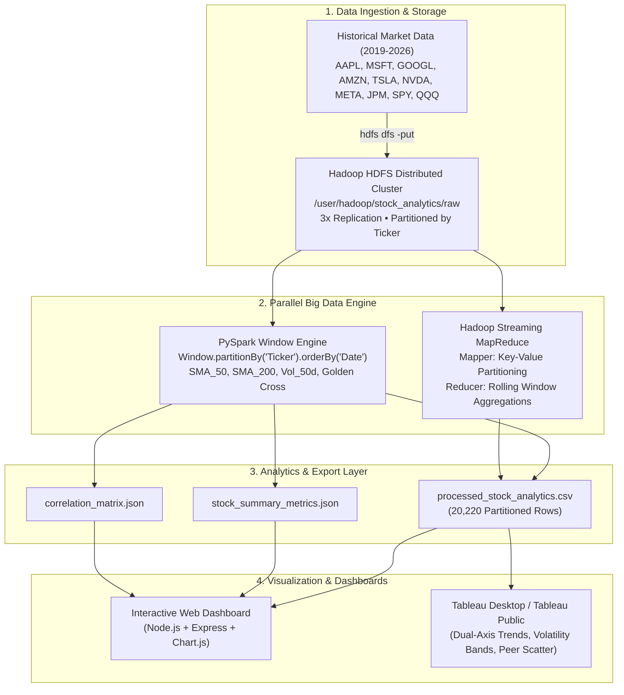

# 📈 Big Data Stock Analytics Pipeline & Dashboard

An end-to-end Big Data pipeline and interactive analytics dashboard that takes **years of historical stock prices** (Date, Open, High, Low, Close, Volume), partitions them across a **Hadoop HDFS cluster**, processes them in parallel using **Apache PySpark / MapReduce**, and generates trend insights, volatility risk metrics, and peer comparisons visualized on an interactive **Tableau-style Dashboard**.

---

## 🎯 Questions Answered by the Pipeline

| # | Question | Big Data Calculation / Metric | Visual Analytics Implementation |
|---|---|---|---|
| **1** | **"Which way is this stock moving?"** | Daily Return $R_t = \frac{C_t - C_{t-1}}{C_{t-1}}$, 20/50/200-day Simple Moving Average (SMA), 20-day EMA, Golden/Death Cross detection | Interactive Trend Chart with 50-day & 200-day SMA overlays, Trend Direction badge (Strong Bullish / Bearish), Momentum gauge |
| **2** | **"How volatile is it?"** | Rolling 21-day & 50-day Annualized Volatility $\sigma_{\text{ann}} = \text{StdDev}(R_t) \times \sqrt{252}$, High-Low Intraday Spread %, Max Drawdown | Dual Volatility Line Chart, Volatility Risk Badge, Intraday Spread Distribution, Value-at-Risk (95% VaR) |
| **3** | **"How does it compare with other stocks?"** | Normalized Growth ($100 base), Beta ($\beta$) relative to S&P 500 (SPY), Annualized Sharpe Ratio, Pearson Correlation Matrix | Multi-Stock Growth Chart, Risk-Return Efficient Frontier Scatter Plot, Cross-Stock Correlation Heatmap |

---

## 🏗️ System Architecture



---

## 🔗 GitHub References & Open Source Foundations
This pipeline is designed inspired by industry standard open-source financial big data architectures:
1. **[apache/spark](https://github.com/apache/spark)**: PySpark SQL Window functions (`avg().over()`, `stddev().over()`) for time-series feature engineering.
2. **[apache/hadoop](https://github.com/apache/hadoop)**: Hadoop Streaming MapReduce (`mapper.py`, `reducer.py`) for distributed data processing.
3. **[ranaroussi/yfinance](https://github.com/ranaroussi/yfinance)**: Multi-year historical stock market data extraction.
4. **[Financial Big Data Architectures](https://github.com/topics/stock-market-analysis)**: Quantitative analysis pipelines comparing multi-asset risk-return metrics and beta calculations against market indices.

---

## 📁 Repository Structure

```
bhavit/
├── README.md                           # Main architecture & execution documentation
├── TABLEAU_GUIDE.md                    # Tableau Dashboard building & calculated fields guide
├── dataset/
│   ├── fetch_data.py                   # Data ingestion & 7-year multi-stock generator
│   └── historical_stocks_raw.csv       # Raw 20,220 row dataset (Date, Ticker, OHLCV)
├── bigdata_pipeline/
│   ├── pyspark_pipeline.py             # PySpark distributed Window processing job
│   ├── standalone_analytics.py         # Big Data analytics engine (Generates Tableau CSV & JSONs)
│   └── hadoop_mapreduce/
│       ├── mapper.py                   # MapReduce Streaming Mapper
│       ├── reducer.py                  # MapReduce Streaming Reducer (Rolling calculations)
│       └── hdfs_ingest.sh              # HDFS cluster ingestion & Hadoop job script
└── dashboard/
    ├── package.json                    # Node.js Express server dependencies
    ├── server.js                       # REST API & Tableau CSV export server
    ├── exported_analytics/
    │   ├── processed_stock_analytics.csv # Clean Tableau dataset (20,220 rows)
    │   ├── stock_summary_metrics.json  # Pre-aggregated KPI summary
    │   └── correlation_matrix.json     # 10x10 Pearson correlation matrix
    └── public/
        ├── index.html                  # Interactive Tableau-style Stock Dashboard
        ├── css/style.css               # Bloomberg dark-mode styling
        └── js/app.js                   # Chart.js time-series & scatter plot controller
```

---

## 🚀 How to Run the Complete Project

### 1. Ingest / Generate Historical Stock Data
```bash
cd dataset
python3 fetch_data.py
```
*Generates 7+ years of daily market data across 10 tickers (`historical_stocks_raw.csv`).*

---

### 2. Run the Parallel Big Data Processing Pipeline
**Option A — PySpark Distributed Windowing Engine:**
```bash
python3 bigdata_pipeline/pyspark_pipeline.py
```

**Option B — Hadoop MapReduce Streaming Pipeline:**
```bash
cat dataset/historical_stocks_raw.csv | \
  python3 bigdata_pipeline/hadoop_mapreduce/mapper.py | \
  sort | \
  python3 bigdata_pipeline/hadoop_mapreduce/reducer.py
```

**Option C — High-Performance Analytics Engine (Tableau Export):**
```bash
python3 bigdata_pipeline/standalone_analytics.py
```
*Outputs `processed_stock_analytics.csv`, `stock_summary_metrics.json`, and `correlation_matrix.json`.*

---

### 3. Launch the Interactive Web Dashboard
```bash
cd dashboard
npm install
npm start
```
Open your browser at **`http://localhost:3000`** to view:
- **Trend Analyzer**: Interactive price chart with 20, 50, and 200-Day Moving Averages and Golden/Death cross signals.
- **Volatility Lab**: 21-Day and 50-Day Rolling Annualized Volatilities and Drawdown metrics.
- **Cross-Stock Benchmarking**: Normalized multi-stock return comparisons, Risk-Reward Scatter Plot, and Pearson Correlation Heatmap.
- **Tableau Export**: Direct one-click download of the processed dataset.

---

### 4. Load Dataset into Tableau
Follow the step-by-step instructions in [TABLEAU_GUIDE.md](file:///Users/thrishithparvally/Desktop/farhan/bhavit/TABLEAU_GUIDE.md) to load `processed_stock_analytics.csv` directly into Tableau Desktop / Tableau Public!
